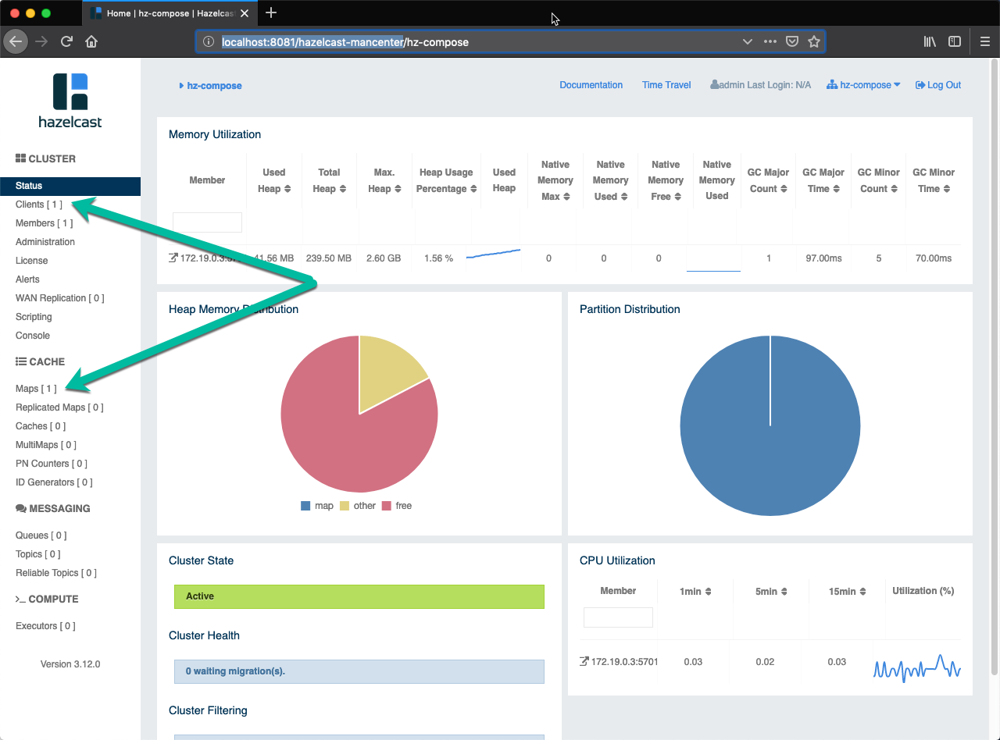
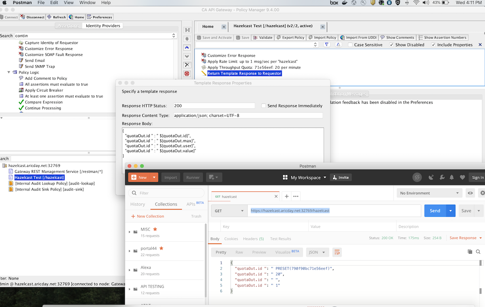

# docker-gateway

This repository contains some of my labs and tests using the Broadcom Layer7 API Gateway docker form factor.

## Getting Started

As of this version, you're going to find 4 docker-compose files as follows:

* **gateway-derby.yml** - deployment of a database-less gateway and not use the hazelcast cluster
* **hazelcast.yml** - hazelcast cluster and management ui. I modified the original repository that can be found [here](https://github.com/hazelcast/hazelcast-code-samples/tree/master/hazelcast-integration/docker-compose).
* **gateway-hazelcast.yml** - same database-less gateway form factor, however using the hazelcast cluster
* **gateway-hazelcast-cluster.yml** - same database-less gateway duplicate-2, distinct gateway also using hazelcast

## Pre-requisites

Before running this project, make sure you have the following:

* Docker and docker-compose installed and working
* Add the gateway file under the folder **license**.

## Running the containers

### Starting a hazelcast cluster and a gateway all together

The following make command will create a Hazelcast cluster, its management UI and also an API gateway form factor.

```bash
make run
```
The Hazelcast Management UI can be accessed by the following URL:

(http://localhost:8081/hazelcast-mancenter)

The hazelcast management container UI port is on 8081 to avoid conflicting with the API gateway HTTP port.

After launching the Hazelcast Management UI for the first time you're going to need to define a password for the user admin.

Within the Hazelcast Management UI look for the following options to see the API gateway interactions:

* **Clients** - Here you can see all the API Gateway, and other clients, connected to the Hazelcast Cluster

* **Maps** - All the maps created by the API Gateway


### Getting the logs

Run the following make command to get attached to all the logs

```bash
make log
```

### Demo Policy

For testing the external integration to hazelcast, the API gateway policy for rate limit and quota are exposed via URL "<server>/hazelcast":

* **Policy** - Here you can see all the demo policy



### Destroying everything

Very handy when you need to start fresh and from scratch. This will kill the containers and also delete the volumes

```bash
make clean
```

### Create a Hazelcast cluster only

If you just want a hazelcast cluster and its management UI, just run the following:

```bash
make hazelcast-cluster
````

Please inspect the **Makefile** for more available commands
